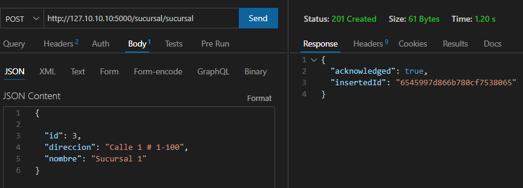

# **Pasos para Configurar y Usar la Aplicación:**

***1. Clonar el Repositorio:*** Clona este repositorio en tu máquina local usando el comando:

```
https://github.com/DiegoMartinez2094/servientrega-.git
```

***2. Instalar Dependencias:*** Asegúrate de tener Node.js instalado en este caso se manejó el proyecto en la v18.16.0. Luego, desde la raíz del proyecto, ejecuta el siguiente comando para instalar las dependencias:

```
npm install
```

***3. Configurar Variables de Entorno:*** Abre el archivo `.env.example` y verifica las variables de entorno necesarias para la conexión al servidor y a la base de datos en Atlas. Asegúrate de proporcionar los valores correctos para `My_server`, `ATLAS_USER`, `ATLAS_PASSWORD` y `ATLAS_DB`. y quita .example que el nombre del archivo sea solo `.env`

***4. Conectar la Base de Datos:*** Para conectar la base de datos utilizando la extensión "MongoDB for VS Code":

* Abre la extensión y selecciona "Connect". Se te pedirá el enlace de conexión de la base de datos que encontrarás en tu página de Atlas.
* Ingresa el enlace de la forma:

  ```
  mongodb+srv://<nombreusuario>:<password>@cluster0.<subdominio>.mongodb.net/
  ```
* Reemplaza `nombreusuaio, password y subdominio`
* Una vez conectado, ejecuta el archivo `db/base_datos.mongodb` haciendo clic en el botón "Mongo Run" en la esquina superior derecha.

***5.Iniciar archivo:*** Ejecutamos el archivo `app.js` mediante el siguiente comando en la terminal:

```
npm run dev
```

Nos dará un mensaje similar a este: `Servidor iniciado en http://127.10.10.10:5011` que nos indica la direccion url donde está corriendo el servidor.

## Utilización de la APP:

Nota: Para la validación utilizaremos la herramienta Extension de Visual Estudio: ThunderClient,

##### coleccion sucursal:

para obtener todas las sucursales utilizamos el endpoint: `http://127.10.10.10:5000/sucursal/sucursal`

y el metodo get 


para obtener una sucursal por su id utilizamos el endpoint: `http://127.10.10.10:5000/sucursal/sucursal/:id`


para postear una sucursal: 

`http://127.10.10.10:5000/sucursal/sucursal`

metodo post



para eliminar una sucursal :

`http://127.10.10.10:5000/sucursal/sucursal/:id`

y el metodo delete


para actualizar una sucursal: 

`http://127.10.10.10:5000/sucursal/sucursal/:id`

y el metodo put


con las demas colecciones realizamos el mismo procedimiento:

##### Coleccion paquete:

`http://127.10.10.10:5000/paquete/paquete`

##### Coleccion envio:

`http://127.10.10.10:5000/envio/envio`

---

cuando realizamos una solicitud como buscar un dato por un id que no está registrado:


**SEGURIDAD:**
Limitante de numero de solicitudes en un determinado tiempo (5 solicitudes en 30 segundos) cuando se supera el limite, saldrá el siguiente mensaje:**"message": "Limite alcanzado",** validador de datos tanto en la solicitud del metodo como en la base de datos.

**ERRORES:**
En caso de esperimentar algún error de conexión de este tipo : "Error: listen EADDRINUSE: address already in use 127.10.10.10:5000"
se debe ingresar al archivo .env y cambiar el puertoMy_server={"hostname":"127.10.10.10", "port":"**5000**"} es el numero que está en negrilla.

En caso de experimentar un error en el programa en general, se recomienda digitar el comando en la terminal Ctrl+C segudio de la letra s y la tecla Intro, de nuevo el comando npm run dev.

En caso de esperimentar otro tipo de errores ponerse en contacto con los desarrolladores.
